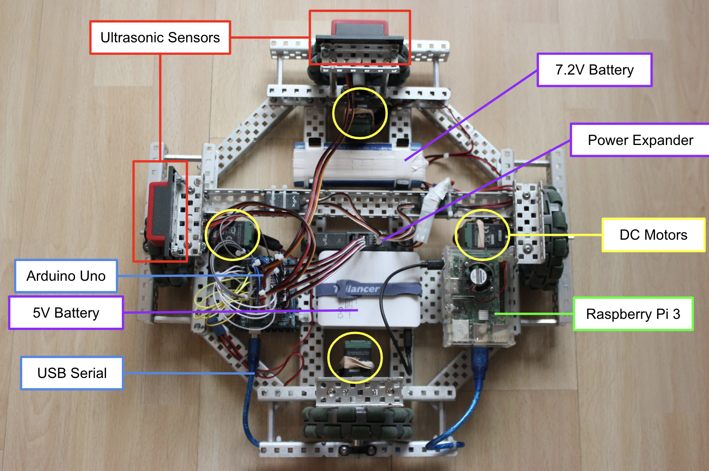

# ITrash
ITrash is an autonomous trash can that can detect projectile garbage, calculate its trajectory, predict where it will land and move accordingly to catch it.

  

Hardware
--------

  

Staff
-----

Programmer : Joon Kang, Maggie Yang, Ke Xu, Tony Sun, Jordan Mao

Work Period
-----------

Start Date: 2020-10-01

End Date: 2020-12-06

